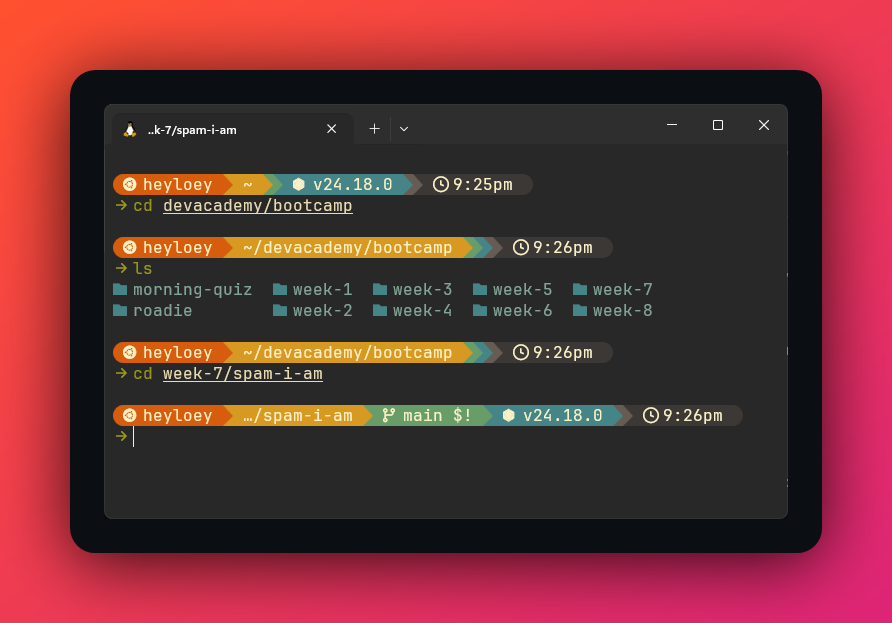
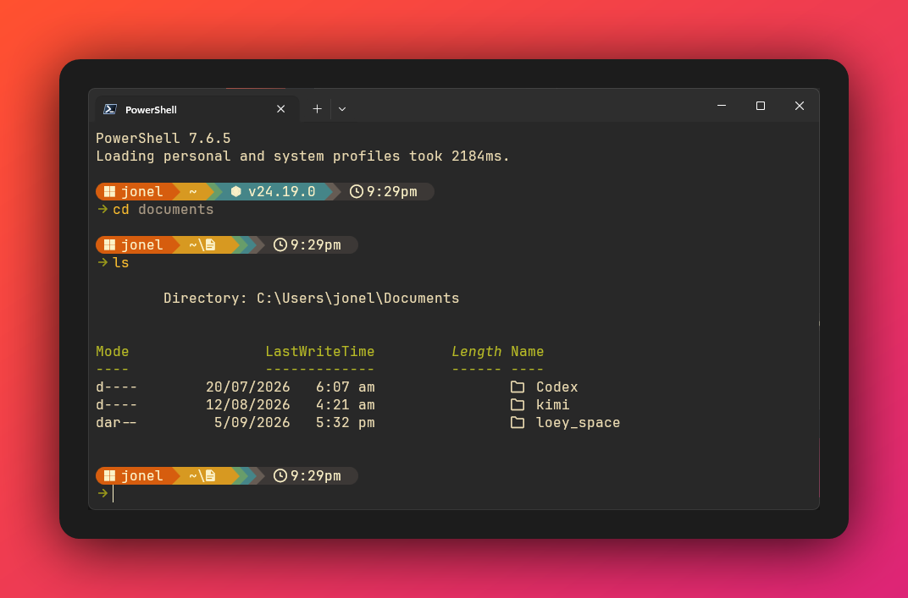

# 💻 Personal Dotfiles


%20%2B%20Windows%2011-b8bb26?color=282828&labelColor=3c3836)

A unified, high-performance, cross-platform terminal environment optimized for developer productivity across **Ubuntu 24.04 (WSL2)** and **Windows 11 (PowerShell 7)**.

---

## 📸 Preview

### 🐧 Ubuntu 24.04 (WSL2) — Zsh + Starship Gruvbox Rainbow


### 🪟 Windows 11 — PowerShell 7 + Starship Gruvbox Rainbow


---

## ✨ Features at a Glance

* **🎨 Unified Visual Design**:
  * **Gruvbox Dark (`#282828`)** palette unified across Windows Terminal, Antigravity IDE, and VS Code.
  * **Typography**: `JetBrainsMono Nerd Font` with full symbol support.
  * **Shared Prompt**: **Starship** with the Gruvbox Rainbow preset and a compact 12-hour AM/PM clock (`5:35pm`) across both Linux and Windows.
* **⚡ Blazing Fast Linux Shell (WSL2 Zsh)**:
  * Startup time slashed from **2.68s to ~0.59s (>4.5× speedup)**.
  * Lazy-loaded NVM and skipped redundant compaudit security checks.
  * 2×2 quad-terminal layout command (`grid`, `grid reset`) with mouse resize and scroll wheel support.
  * Built-in security guardrails: `HIST_IGNORE_SPACE` prevents commands with a leading space from saving to history, plus automatic sourcing of gitignored `~/.zshrc.local` for machine-specific secrets.
* **🪟 Modern Windows Shell (PowerShell 7)**:
  * **UTF-8 console encoding** enforced to eliminate broken emojis, Git logs, and symbols.
  * **PSReadLine Predictive IntelliSense** with Gruvbox muted gray (`#928374`) inline autocompletion (<kbd>Ctrl</kbd> + <kbd>Spacebar</kbd>).
  * **Microsoft `CompletionPredictor`** for intelligent command line argument predictions.
  * **`Terminal-Icons`** for rich file & directory glyphs in `ls` and `dir`.
  * **Deep Git Tab Completion** via `posh-git`.
  * **Linux/Zsh Parity Bridges**: `which`, `grep`, `touch`, `open`, `pbcopy`/`pbpaste`, `cdwsl`, and git aliases (`gst`, `gp`, `gl`, `gco`, `gcb`, `lg`).
  * **Private Overrides**: Automatically loads gitignored `$HOME/.profile.local.ps1` if present.
* **🔍 Modern Rust CLI Suite**:
  * `fzf` & `fd`: Fuzzy file finding (<kbd>Ctrl</kbd> + <kbd>T</kbd>) and history search (<kbd>Ctrl</kbd> + <kbd>R</kbd>).
  * `zoxide`: Smart directory jumping (`z <folder>`, `zi`).
  * `eza`: Colorized directory listings with Git status and file icons (`ls`, `ll`, `tree`).
  * `bat`: Syntax-highlighted text and code viewer (`cat`).
  * `lazygit`: Full-screen Git terminal UI (`lg`).

---

## 📁 Repository Structure

```text
dotfiles/
├── .gitignore                       # Safeguard against committing secrets & temp files
├── .zshrc                           # Optimized Zsh configuration (WSL2)
├── starship.toml                    # Shared Starship Gruvbox Rainbow configuration
├── .tmux.conf                       # Tmux quad-terminal & ergonomics settings
├── install.sh                       # One-click bootstrap installer for Linux / WSL2
├── TERMINAL_CHEATSHEET.md           # Full CLI and shortcut cheatsheet
├── assets/                          # Demo screenshots and visual assets
│   ├── ubuntu-wsl2-demo.png
│   └── powershell-demo.png
├── bin/
│   └── cheatsheet                   # Interactive ANSI terminal reference tool
└── windows/
    ├── Microsoft.PowerShell_profile.ps1 # Complete PowerShell 7 profile
    ├── WindowsPowerShell_profile.ps1    # Aligned Windows PowerShell 5.1 profile
    ├── terminal-settings.json       # Windows Terminal settings (Gruvbox Dark)
    ├── install.ps1                  # One-click bootstrap installer for Windows
    └── my-posh-theme.omp.json       # Oh My Posh theme (backup / legacy fallback)
```

---

## 🚀 Quick Start / Installation

### 1. On Ubuntu 24.04 / WSL2
```bash
git clone https://github.com/lowqualityloey/dotfiles.git ~/dotfiles
cd ~/dotfiles
chmod +x install.sh
./install.sh
source ~/.zshrc
```

### 2. On Windows 11 (PowerShell 7)
Open **PowerShell 7** as your standard user:
```powershell
git clone https://github.com/lowqualityloey/dotfiles.git "$HOME\dotfiles"
& "$HOME\dotfiles\windows\install.ps1"
reload
```

---

## ⌨️ Common Shortcuts & Cheatsheet

| Command / Key | Scope | What It Does |
| :--- | :--- | :--- |
| **`cheatsheet`** | WSL2 | Displays clean interactive CLI quick-reference card (`cheatsheet --full` for manual) |
| **`grid`** / **`grid reset`** | WSL2 | Launches, resumes, or resets a 2×2 quad-terminal layout in 1 window |
| **`z <folder>`** | WSL2 & Win | Smart-jump to frequent folders (`z shelf`, `z doc`) |
| **`zi`** | WSL2 & Win | Interactive fuzzy directory selection menu |
| <kbd>Ctrl</kbd> + <kbd>T</kbd> | WSL2 & Win | Fuzzy-search files in current folder with live syntax preview |
| <kbd>Ctrl</kbd> + <kbd>R</kbd> | WSL2 & Win | Fuzzy-search command history |
| <kbd>Ctrl</kbd> + <kbd>Space</kbd> | WSL2 & Win | Instantly accept inline predictive autocompletion |
| **`lg`** | WSL2 & Win | Launch LazyGit Terminal UI |
| **`gst`**, **`gp`**, **`gl`** | WSL2 & Win | Git status, push, pull |
| **`gco`**, **`gcb`** | WSL2 & Win | Git checkout, checkout new branch |
| **`which <cmd>`** | WSL2 & Win | Find executable location (bridges to `Get-Command` on Windows) |
| **`grep <pat>`** | WSL2 & Win | Text search (bridges to `Select-String` on Windows) |
| **`open`** | WSL2 & Win | Open current directory in Windows File Explorer |
| **`pbcopy`** / **`pbpaste`** | WSL2 & Win | Read/write directly to the Windows system clipboard |
| **`cdwsl`** | Windows | Jump directly to Ubuntu WSL2 home folder (`\\wsl$\Ubuntu\home\heyloey`) |
| **`reload`** | WSL2 & Win | Re-source shell profile without restarting terminal window |
| **`sysclean`** | Windows | Flush DNS and clean temporary system files |
| **`sysupdate`** | Windows | Upgrade all Windows apps via WinGet and Chocolatey |

*(See [TERMINAL_CHEATSHEET.md](TERMINAL_CHEATSHEET.md) for full documentation).*

---

## 🔒 Private Overrides & Secrets

To keep work credentials, private API keys, and machine-specific configurations safe from your public Git repository:

* **Linux / WSL2 (`~/.zshrc.local`)**:
  Create `~/.zshrc.local` for sensitive tokens or company aliases. It is automatically sourced by `.zshrc` and ignored by Git:
  ```zsh
  export GITHUB_TOKEN="ghp_..."
  export OPENAI_API_KEY="sk-..."
  ```
* **Windows (`~/.profile.local.ps1`)**:
  Create `$HOME\.profile.local.ps1` for Windows-specific private environment variables or secrets:
  ```powershell
  $env:ANTHROPIC_API_KEY = "sk-ant-..."
  ```

---

## 🔄 Daily Workflow & Syncing

An alias `dotfiles` is configured in your shell to track and manage this repo from anywhere:

```zsh
dotfiles status
dotfiles add -A
dotfiles commit -m "Update aliases"
dotfiles push
```
