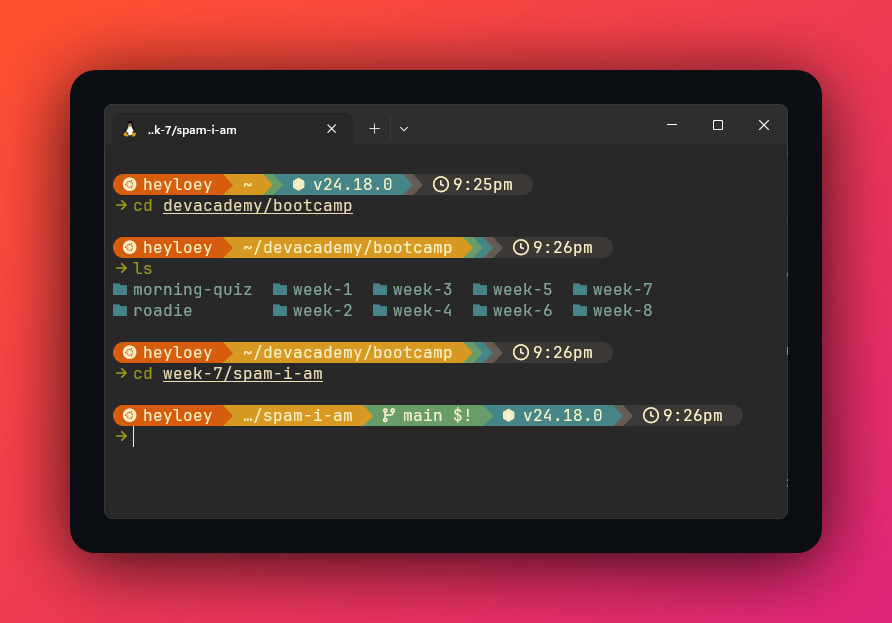
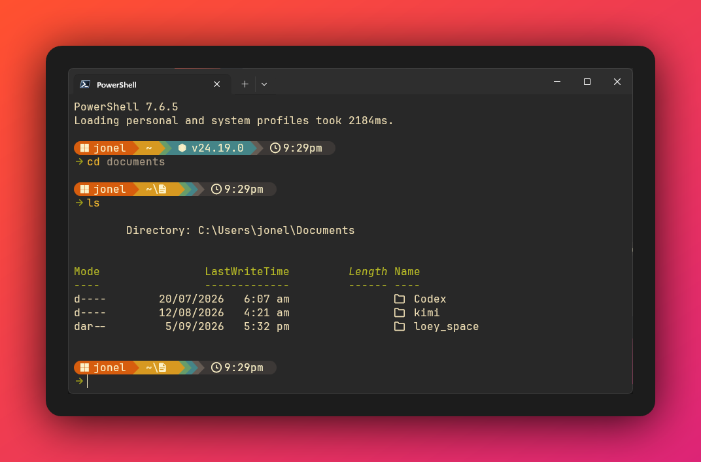

# 💻 Personal Dotfiles


%20%2B%20Windows%2011-b8bb26?color=282828&labelColor=3c3836)

[](https://github.com/lowqualityloey/dotfiles/actions/workflows/tests.yml)

A unified, high-performance, cross-platform terminal environment optimized for developer productivity across **Ubuntu 24.04 (WSL2)** and **Windows 11 (PowerShell 7)**.

---

## 📸 Preview

### 🐧 Ubuntu 24.04 (WSL2) — Zsh + Starship Gruvbox Rainbow


### 🪟 Windows 11 — PowerShell 7 + Starship Gruvbox Rainbow


---

## ✨ Features at a Glance

* **🎨 Unified Visual Design**:
  * **Gruvbox Dark (`#282828`)** palette, shipped for Windows Terminal in `windows/terminal-settings.json` (the `Gruvbox Dark` scheme plus the Nerd Font defaults). The IDE palettes are configured in the IDEs themselves and are not part of this repo.
  * **Typography**: `JetBrainsMono Nerd Font` with full symbol support.
  * **Shared Prompt**: **Starship** with the Gruvbox Rainbow preset and a compact 12-hour AM/PM clock (`5:35pm`) across both Linux and Windows.
* **⚡ Blazing Fast Linux Shell (WSL2 Zsh)**:
  * Startup time cut from **2.68s to ~0.7s (~3.8x faster)**, measured with `zsh -i -c exit`.
  * Lazy-loaded NVM and skipped redundant compaudit security checks.
  * 2×2 quad-terminal layout command (`grid`, `grid reset`) with mouse resize and scroll wheel support.
  * Built-in security guardrails: a `zshaddhistory` hook drops credential-shaped commands before they ever reach `~/.zsh_history` (`HIST_IGNORE_SPACE` stays as a manual second layer), if you use atuin, `install.sh` writes a matching `history_filter` into `~/.config/atuin/config.toml` (atuin records via `preexec`/`precmd`, so the hook never sees it); gitignored `~/.zshrc.local` holds machine-specific secrets, and a daily systemd timer reports any key-shaped strings left behind in agent caches (see [Credential-Leak Monitoring](#-credential-leak-monitoring)).
* **🪟 Modern Windows Shell (PowerShell 7)**:
  * **UTF-8 console encoding** enforced to eliminate broken emojis, Git logs, and symbols.
  * **PSReadLine Predictive IntelliSense** with Gruvbox muted gray (`#928374`) inline autocompletion (<kbd>Ctrl</kbd> + <kbd>Spacebar</kbd>).
  * **Microsoft `CompletionPredictor`** for intelligent command line argument predictions.
  * **`Terminal-Icons`** for rich file & directory glyphs in `ls` and `dir`.
  * **Deep Git Tab Completion** via `posh-git`.
  * **Linux/Zsh Parity Bridges**: `which`, `grep`, `touch`, `open`, `pbcopy`/`pbpaste`, `cdwsl`, and git helpers (`gst`, `gp`, `gl`, `gco`, `gcb`) plus `lg` for LazyGit.
  * **Kiro & Chocolatey Integration**: Sources the Kiro shell integration when `$env:TERM_PROGRAM` is `kiro`, and loads `chocolateyProfile.psm1` when present.
  * **Private Overrides**: Automatically loads gitignored `$HOME/.profile.local.ps1` if present.
* **🔍 Modern Rust CLI Suite**:
  * `fzf` & `fd`: Fuzzy file finding (<kbd>Ctrl</kbd> + <kbd>T</kbd>) and history search (<kbd>Ctrl</kbd> + <kbd>R</kbd>).
  * `zoxide`: Smart directory jumping (`z <folder>`, `zi`).
  * `eza`: Colorized directory listings with Git status and file icons (`ls`, `ll`, `tree`).
  * `bat`: Syntax-highlighted text and code viewer (`cat`).
  * `procs`: Process viewer with tree view and built-in filtering (`procs nginx`).
  * `sd`: Intuitive find-and-replace across files (`sd 'before' 'after' file`).
  * `ouch`: One command for every archive format (zip, tar, 7z, zstd, …).
  * `tldr` (tealdeer): Offline, searchable example pages for CLI tools (`tldr tar`).
  * The last four are deliberately **not** aliased over `ps`, `sed` or `find`: those replacements have different output and escaping, so shadowing them breaks scripts and pipelines that parse the originals. `procs` and `tldr` are installed on Windows too (`windows/install.ps1`); `sd` and `ouch` are Linux-only.
  * `lazygit`: Full-screen Git terminal UI (`lg`), with its diff panel rendered through `delta` so it matches `git diff`.
  * `delta`: Gruvbox-themed diffs as the Git pager, with line numbers and move detection. Goes side-by-side on terminals at least 100 columns wide and falls back to a unified diff below that (config `git/delta.gitconfig`, wrapper `bin/delta-pager`). Note that side-by-side truncates individual very long lines at *any* width — delta marks them with `↴` — so a wide window helps but does not eliminate it.
* **🔁 Portable by Design**:
  * No hardcoded usernames, WSL distro names, or user-specific home paths. Linux uses `$HOME`; on Windows `cdwsl` resolves the default distro and its home at runtime. (The one absolute path left is Linuxbrew's fixed `/home/linuxbrew/.linuxbrew`, which is identical on every machine that installs it.)
  * Optional tools that may be absent (`brew`, `atuin`, GitButler, `oh-my-posh`) are skipped cleanly instead of erroring on a fresh machine.

---

## 📁 Repository Structure

```text
dotfiles/
├── .gitignore                       # Safeguard against committing secrets & temp files
├── LICENSE                          # MIT License
├── .zshrc                           # Optimized Zsh configuration (WSL2)
├── starship.toml                    # Shared Starship Gruvbox Rainbow configuration
├── .tmux.conf                       # Tmux quad-terminal & ergonomics settings
├── install.sh                       # One-click bootstrap installer for Linux / WSL2
├── requirements-dev.txt             # Pinned pytest for the test suite (dev only)
├── README.md                        # This file
├── TERMINAL_CHEATSHEET.md           # Full CLI and shortcut cheatsheet
├── git/
│   └── delta.gitconfig              # delta pager settings, included from ~/.gitconfig
├── lazygit/
│   └── config.yml                   # lazygit renders its diff panel through delta
├── .github/
│   └── workflows/
│       └── tests.yml                # Test suite + lint on main, wip/**, and pull requests
├── tests/
│   ├── run.sh                       # Runs the tests and lints the shell scripts
│   ├── test-delta-pager.sh          # Regression tests for the pager width threshold
│   ├── test-install-atuin.sh        # Regression tests for the installer's atuin step
│   ├── test-secret-leaks.sh         # Regression tests for the credential-leak scanner
│   ├── test-zsh-startup.sh          # Checks an interactive shell starts without parse errors
│   └── test_secret_scan.py          # Unit tests for the shared scan module
├── assets/                          # Demo screenshots and visual assets
│   ├── ubuntu-wsl2-demo.png
│   └── powershell-demo.png
├── bin/
│   ├── cheatsheet                   # Interactive ANSI terminal reference tool
│   ├── check-secret-leaks           # Flags credential-shaped strings in local logs/caches
│   ├── delta-pager                  # Width-aware Git pager wrapper for delta
│   ├── scrub-secrets                # Redacts those strings (dry-run by default)
│   └── secret_scan.py               # Shared detection patterns for the two tools
├── zsh/
│   └── plugins/
│       └── fzf/
│           └── fzf.plugin.zsh       # Quiet fzf integration (shadows the oh-my-zsh plugin)
├── systemd/
│   └── user/
│       ├── secret-leak-check.service
│       └── secret-leak-check.timer  # Daily credential-leak check
└── windows/
    ├── Microsoft.PowerShell_profile.ps1 # Complete PowerShell 7 profile
    ├── WindowsPowerShell_profile.ps1    # Aligned Windows PowerShell 5.1 profile
    ├── terminal-settings.json       # Windows Terminal settings (Gruvbox Dark)
    ├── install.ps1                  # One-click bootstrap installer for Windows
    └── my-posh-theme.omp.json       # Oh My Posh theme (fallback when Starship is absent)
```

---

## 📋 Prerequisites

Before running the installers:
* **Font**: Install [JetBrainsMono Nerd Font](https://www.nerdfonts.com/font-downloads) (or any Nerd Font) and configure it as the font in your terminal emulator (e.g., Windows Terminal) so all powerline glyphs and file icons render properly.
* **Linux / WSL2**: Ensure base tools are available:
  ```bash
  sudo apt update && sudo apt install -y zsh git curl
  ```
  *(The installer automatically installs Oh My Zsh and clones missing custom plugins for you).*

---

## 🚀 Quick Start / Installation

### 1. On Ubuntu 24.04 / WSL2
```bash
git clone https://github.com/lowqualityloey/dotfiles.git ~/dotfiles
cd ~/dotfiles
chmod +x install.sh
./install.sh
source ~/.zshrc
```

### 2. On Windows 11 (PowerShell 7)
Open **PowerShell 7** as your standard user:
```powershell
git clone https://github.com/lowqualityloey/dotfiles.git "$HOME\dotfiles"
& "$HOME\dotfiles\windows\install.ps1"
reload
```

> **Run this in PowerShell 7 (`pwsh`), not Windows PowerShell 5.1.** The installer writes both profiles, but it derives the target from the *running* host's `$PROFILE` — under `powershell.exe` that resolves to the 5.1 profile, so the PowerShell 7 profile would never be updated (and the two would be overwritten by each other). Launch `pwsh`, or Windows Terminal's PowerShell 7 profile, before running it.

> **Note on Windows Terminal**: [`windows/terminal-settings.json`](windows/terminal-settings.json) is provided as a complete reference. If you already have existing profiles, you can copy the `Gruvbox Dark` scheme and `defaults` font block into your own settings without overwriting your custom profile GUIDs. The bundled settings pin no distro-specific profile or starting directory, so the `WSL` profile adapts to whichever distro you have installed.

---

## ⌨️ Common Shortcuts & Cheatsheet

| Command / Key | Scope | What It Does |
| :--- | :--- | :--- |
| **`cheatsheet`** | WSL2 | Displays clean interactive CLI quick-reference card (`cheatsheet --full` for manual) |
| **`grid`** / **`grid reset`** | WSL2 | Launches, resumes, or resets a 2×2 quad-terminal layout in 1 window |
| **`z <folder>`** | WSL2 & Win | Smart-jump to frequent folders (`z shelf`, `z doc`) |
| **`zi`** | WSL2 & Win | Interactive fuzzy directory selection menu |
| **`procs`** | WSL2 & Win | Process viewer with tree view and built-in filtering (`procs nginx`) |
| **`sd`** | WSL2 | Intuitive find-and-replace across files (`sd 'old' 'new' file`) |
| **`ouch`** | WSL2 | Compress or extract any archive format in one command |
| **`tldr <cmd>`** | WSL2 & Win | Offline example pages for a command (tealdeer) |
| <kbd>Ctrl</kbd> + <kbd>T</kbd> | WSL2 & Win | Fuzzy-search files in current folder with live syntax preview |
| <kbd>Ctrl</kbd> + <kbd>R</kbd> | WSL2 & Win | Fuzzy-search command history |
| <kbd>Ctrl</kbd> + <kbd>Space</kbd> | WSL2 & Win | Instantly accept inline predictive autocompletion |
| **`lg`** | WSL2 & Win | Launch LazyGit Terminal UI |
| **`gst`**, **`gp`**, **`gl`** | WSL2 & Win | Git status, push, pull |
| **`gco`**, **`gcb`** | WSL2 & Win | Git checkout, checkout new branch |
| **`which <cmd>`** | WSL2 & Win | Find executable location (bridges to `Get-Command` on Windows) |
| **`grep <pat>`** | WSL2 & Win | Text search (bridges to `Select-String` on Windows) |
| **`open`** | WSL2 & Win | Open current directory in Windows File Explorer |
| **`pbcopy`** / **`pbpaste`** | WSL2 & Win | Read/write directly to the Windows system clipboard |
| **`cdwsl`** | Windows | Jump to your default WSL distro's home folder (distro & user resolved at runtime) |
| **`cddoc`** | Windows | Jump directly to Documents folder (supports OneDrive or local Documents) |
| **`check-secret-leaks`** | WSL2 | Report credential-shaped strings in local agent logs/caches (exits 1 if any) |
| **`scrub-secrets`** | WSL2 | Redact those strings (`--apply`; dry-run by default) |
| **`reload`** | WSL2 & Win | Re-source shell profile without restarting terminal window |
| **`sysclean`** | Windows (PS7) | Flush DNS and clean temporary system files |
| **`sysupdate`** | Windows (PS7) | Upgrade all Windows apps via WinGet and Chocolatey |

*(See [TERMINAL_CHEATSHEET.md](TERMINAL_CHEATSHEET.md) for full documentation).*

---

## 🔒 Private Overrides & Secrets

Keep work credentials, private API keys, and machine-specific configuration out of this public repository. Three mechanisms, in order of preference:

* **Environment variables — Linux / WSL2 (`~/.zshrc.local`)**:
  Automatically sourced by `.zshrc` if present. It sits outside the repo (`~/` is not a Git repository) and is additionally covered by `.gitignore` (`*.local`, `.zshrc.local`):
  ```zsh
  export GITHUB_TOKEN="github_pat_..."
  export OPENAI_API_KEY="sk-..."
  ```
* **Environment variables — Windows (`~/.profile.local.ps1`)**:
  Automatically sourced by both the PowerShell 7 and 5.1 profiles if present:
  ```powershell
  $env:ANTHROPIC_API_KEY = "sk-ant-..."
  ```
* **File references for tool configs (`~/.secrets/`, mode `600`)**:
  Some tools do not substitute environment variables in every field — notably `provider.<name>.options.apiKey` in `opencode.json`, where `{env:...}` is passed through as a literal string. Use `{file:...}` there instead:
  ```jsonc
  "apiKey": "{file:~/.secrets/vercel-api-key}"
  ```
  ```bash
  mkdir -p ~/.secrets && chmod 700 ~/.secrets
  printf '%s' "$KEY" > ~/.secrets/vercel-api-key   # no trailing newline
  chmod 600 ~/.secrets/vercel-api-key
  ```

> ⚠️ **Never put a secret in `.zshrc`.** That file is tracked by Git, so a token there is one `dotfiles add -A && dotfiles commit && dotfiles push` away from being published. Rotating a leaked token does not remove copies already written into editor backups, shell history, or pasted chat transcripts — keep secrets out of tracked files from the start.

---

## 🛡️ Credential-Leak Monitoring

Moving a secret out of a tracked file is not the end of the story. Agent tools (opencode/manicode, Cline, Gemini, Codex, Kiro) persist transcripts, history and search indexes, so any token that appears in a prompt or on a command line is written to disk in several places at once. Shell history is guarded at the source by the `zshaddhistory` hook, but tool caches still need sweeping. Atuin records through `preexec`/`precmd`, so the hook alone would not cover it — `install.sh` therefore writes a matching `history_filter` into `~/.config/atuin/config.toml` (idempotent, previous copy backed up, only that key touched). The patterns are imported from `bin/secret_scan.py`, so they cannot drift from what the scanner reports:

```toml
# ~/.config/atuin/config.toml
history_filter = [
  "github_pat_[A-Za-z0-9_]{82}",  # GitHub PAT (93 chars total)
  "sk-proj-[A-Za-z0-9_-]{30,}",  # OpenAI key
  "sk-or-v1-[A-Za-z0-9]{40,}",  # OpenRouter key
  "vck_[A-Za-z0-9]{40,}",  # Vercel key
]
```

* **`check-secret-leaks`** walks those stores, prints one line per affected file, and exits non-zero when it finds key-shaped strings.
* **`scrub-secrets`** redacts them — dry-run by default, `--apply` to write. It rewrites SQLite databases in place with `secure_delete` + WAL checkpoint + `VACUUM`, so the old bytes do not survive in free pages.
* **Windows-side too (WSL)**: these tools keep the same caches on the Windows drive, so the profile under `C:\Users\<you>` is swept as well — resolved at runtime via `wslvar USERPROFILE` (never hardcoded), covering `.codex`, `.gemini`, `.claude`, `.dsh`, `AppData/Roaming/Code/User`, `AppData/Local/OpenAI` and friends. Pass `--no-windows` for a Linux-only scan; on WSL2 that measured 1.5s with the agent caches idle and 12s while a 131 MB transcript was being rewritten, versus about 79s for a full `/mnt/c` sweep (browser profiles and VS Code caches are skipped). Both figures scale with how much those caches have grown and how actively they are being written.
* **Daily timer**: `install.sh` installs `secret-leak-check.timer`, which runs the check once a day and records the result in the user journal.

```bash
check-secret-leaks            # report only
scrub-secrets                 # show what would be redacted
scrub-secrets --apply         # actually redact

systemctl --user list-timers secret-leak-check.timer
journalctl --user -u secret-leak-check --since yesterday
```

> Findings make the unit exit non-zero on purpose, so `systemctl --user status secret-leak-check` reports it as *failed* — that is the alarm, not a bug. Legitimate credential stores (`~/.secrets/`, `~/.zshrc.local`, tool-managed auth files, and live configs that intentionally hold a key) are skipped; add `--include-stores` to include them. Both tools use `rg` when present and fall back to a Python walk otherwise.

> **A running agent can put the token back.** Redaction only rewrites what is on disk. A still-running agent session or IDE that holds the token in memory will re-persist it on its next write, and the next scan will flag the same file again — so a re-scrub that appears not to stick means the source is still live, not that the scrub failed. Stop the session first, then scrub, and **rotate the credential either way**: it sat in plaintext on disk, so treat it as exposed rather than relying on cleanup.

---

## 🔄 Daily Workflow & Syncing

An alias `dotfiles` is configured in your shell to track and manage this repo from anywhere:

```zsh
dotfiles status
dotfiles add -A
dotfiles commit -m "Update aliases"
dotfiles push
```

> **Before pushing:** `add -A` stages *everything* in the repo, so a secret accidentally placed in a tracked file (`.zshrc`, a profile, a config) will be committed along with your real changes. Keep secrets in `~/.zshrc.local`, `~/.profile.local.ps1`, or `~/.secrets/` — see [Private Overrides & Secrets](#-private-overrides--secrets).

---

## 🧪 Tests

No test framework is required — each test under `tests/` is a self-contained script that exits non-zero on failure. `tests/run.sh` discovers and runs them all, then lints the shell scripts with `shellcheck`, and fails if anything is wrong:

```bash
sh tests/run.sh            # full output
sh tests/run.sh --quiet    # only failures and the summary
```

A full run prints a `== <name> ==` banner per check, that check's own output, an `ok:`/`FAILED:` line, and a final tally:

```text
== test-delta-pager.sh ==
...
ok: test-delta-pager.sh

== test-install-atuin.sh ==
...
ok: test-install-atuin.sh

== test-secret-leaks.sh ==
...
ok: test-secret-leaks.sh

== test-zsh-startup.sh ==
...
ok: test-zsh-startup.sh

Python tests: pytest 9.1.1

== test_secret_scan.py [pytest] ==
5 passed in 0.04s
ok: test_secret_scan.py [pytest]

== shellcheck ==
ok: shellcheck

6 check(s) run, 0 failed
```

Flags and overrides:

* `-q`, `--quiet` — print only failures and the summary.
* `-h`, `--help` — show usage.
* `PYTHON=/path/to/python3` — run the Python tests with a different interpreter.

The runner discovers `tests/test-*.sh` (run with `sh`) and `tests/test_*.py` (run with `pytest` when it is importable, otherwise plainly with `python3`), so a new test only has to be dropped in the directory and any single test can still be run directly. When pytest is used the runner names the version it picked (`Python tests: pytest 9.1.1`); `requirements-dev.txt` pins that version — install it with `python3 -m pip install -r requirements-dev.txt`, or point `PYTHON` at a virtualenv that already has it. The lint step covers `install.sh`, every `sh`/`bash` script in `bin/`, and the tests themselves; it is skipped with a note when `shellcheck` is not installed.

The suite also runs in CI on pushes to `main` and `wip/**` branches, and on pull requests — see `.github/workflows/tests.yml`. It reports one stable status check, `CI / tests`, that branch protection can require. The job installs pytest so the pytest path is exercised, and asserts `shellcheck` is present so a green run always includes the lint.

The pager wrapper's only job is choosing a flag, so its tests stub `delta` and `tput` and assert the arguments it would pass. The credential-leak scanner's tests build token-shaped fakes in a temp directory and round-trip them through `check-secret-leaks` and `scrub-secrets`, while `test_secret_scan.py` monkeypatches the shared module to pin down Windows-profile resolution and the `WALK_SKIP` pruning.

`test-zsh-startup.sh` guards against the one failure mode that is otherwise invisible: zsh abandons the rest of `.zshrc` at the first parse error and still exits 0, so a broken config looks like a working one. It first checks the file against synthetic broken and clean fixtures, so the detector itself is known to work rather than assumed to, then starts a real interactive shell against a *copy* of the config in a temporary `ZDOTDIR` and asserts the run reaches the end and leaves stderr empty. Defining a function over an existing alias — which oh-my-zsh's git plugin makes easy to hit — is one of the cases it reproduces deliberately.

`test-install-atuin.sh` covers the installer step that rewrites `history_filter` in your hand-edited atuin config, the only step that edits a key inside a user file. It runs the whole installer inside a throwaway sandbox — temp `HOME`, a short `PATH` of symlinks, stubbed `atuin` and `systemctl`, and a pre-made oh-my-zsh — then asserts the write is idempotent, that a backup holds the pre-change bytes, that a stale filter is replaced in place while neighbouring sections survive, that the result still parses as TOML, and that every written pattern compiles as a regex and matches `bin/secret_scan.py` exactly. It skips when `python3` predates `tomllib`.

Nothing in the suite touches a real home directory, secret, Windows profile, the network, or your live shell config; the two new tests skip with a note when `zsh`, oh-my-zsh, or a suitable `python3` is missing, so a reduced CI runner loses coverage rather than reporting a false failure.

---

## 📄 License

This project is open source and available under the [MIT License](LICENSE). Feel free to use, fork, and adapt these configurations for your own setup.
